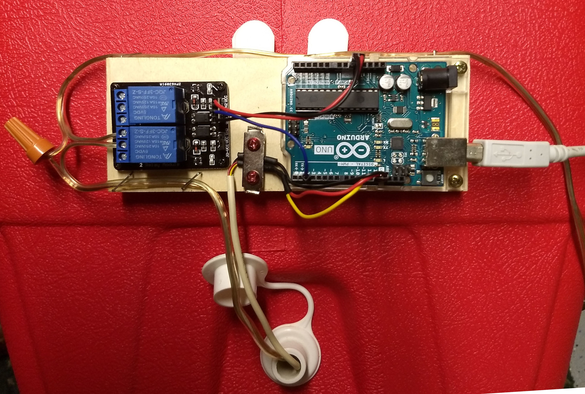

# Prooferator
Arduino-controlled "proofing" box for bread dough.

This project arose from a need for a constant temperature warm (but not hot) environment in which to let sourdough bread "proof" - i.e., grow, rise, mature, etc.  It's made from simple stuff I had lying around the house, mostly:
- an Igloo picnic cooler
- a 12V, 15W automotive light bulb
- an old 13.5 VAC "wall wart" power supply
- an Arduino equipped with a DS18S20 temperature sensor and a relay module to run a servo control of the temperature (i.e., a thermostat)

I also created a Python-based GUI (using PyQt5) to monitor the temperature and change the set point.

Perhaps surprisingly, the 15W light bulb is enough to heat the interior of the Igloo to over 90&deg; F.  With a set point of 80&deg; F, the bulb cycles on an off every few minutes.
## Hardware
Here's the igloo with the lightbulb and sensor installed. No physical modifications are made to the Igloo, so it can be put back to use as a cooler in the future.  The wires come in through the drain hole.  The light bulb is mounted at the far end of the cooler, near the bottom (since heat rises). It's stuck to the inside of the cooler with Velcro Command strips that can be easily removed if necssary. The wire is old speaker wire, suitable for the approx. 1 A of current that the bulb will draw. The sensor is on a stiff wire (I used a length of old 4-wire telephone wiring).   

  

The Arduino and relay board are screwed to a wooden block mounted with Velco Command strips to the outside of the Igloo above the drain plug.   
### Wiring
The Temperature sensor uses the OneWire Arduino library for communication, so only needs three wires. +5 V is provided to the sensor via the Arduino's pin 13, which is set HIGH in the Arduino code. Ground is provided by the nearby GND pin. The signal wire goes to pin 10, and is also pulled up by a 4.7 k&Omega; resistor attached to +5 V.  The relay board gets its +5V and ground connections from the 5V and GND pins on the Arduino, and relay 1 on the board is connected to pin 2 (relay 2 is not used). 

