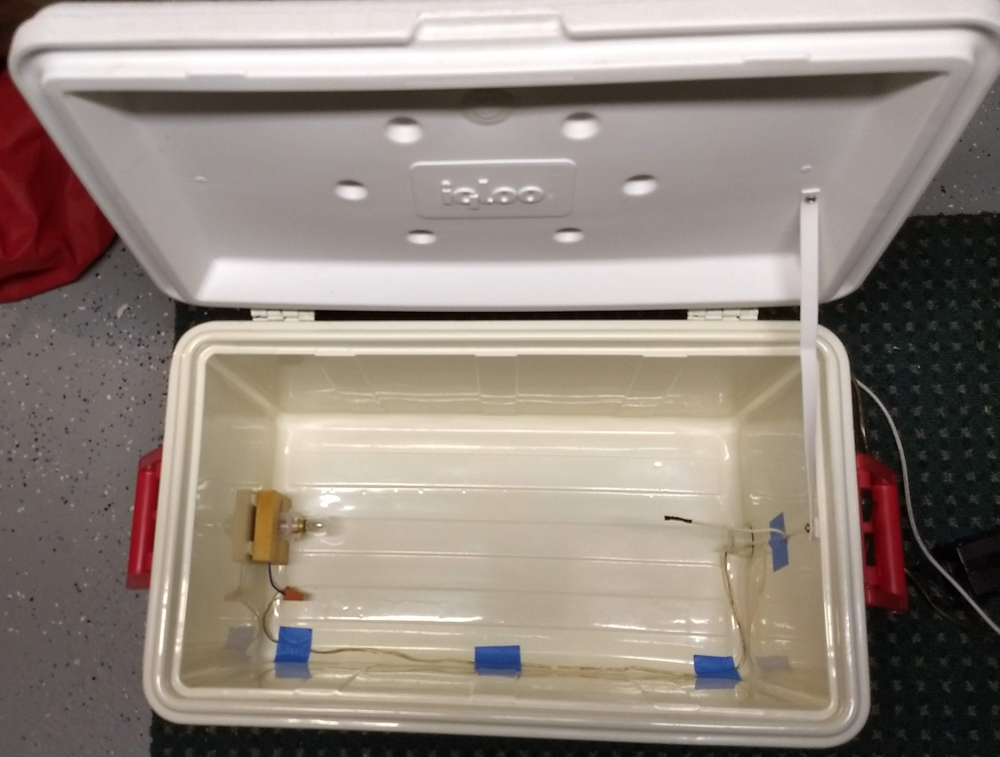
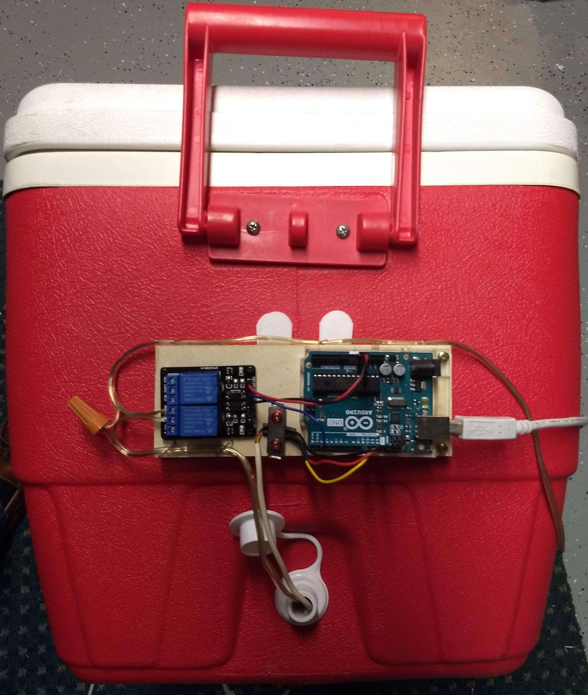

# Prooferator
Arduino-controlled "proofing" box for bread dough

This project arose from a need for a constant temperature warm (but not hot) environment in which to let sourdough bread "proof" - i.e., grow, rise, mature, etc.  It's made from simple stuff I had lying around the house, mostly:
- an Igloo picnic cooler
- a 12V, 15W automotive light bulb
- an Arduino equipped with a DS18S20 temperature Sensor and a relay module to run a servo control of the temperature (i.e., a thermostat)

I also created a Python-based GUI (using PyQt5) to monitor the temperature and change the set point.

Perhaps surprisingly, the 15W light bulb is enough to heat the interior of the Igloo to over 90&deg; F.  With a set point of 80&deg; F, the bulb cycles on an off every few minutes.
## Hardware
Here's the igloo with the lightbulb and sensor installed. No physical modifications are made to the Igloo, so it can be put back to use as a cooler in the future.  The wires come in through the drain hole.  The light bulb is mounted at the far end of the cooler, near the bottom (since heat rises). The senor is on a stiff wire (i used a length of old 4-wire telephone wiring).   

  

