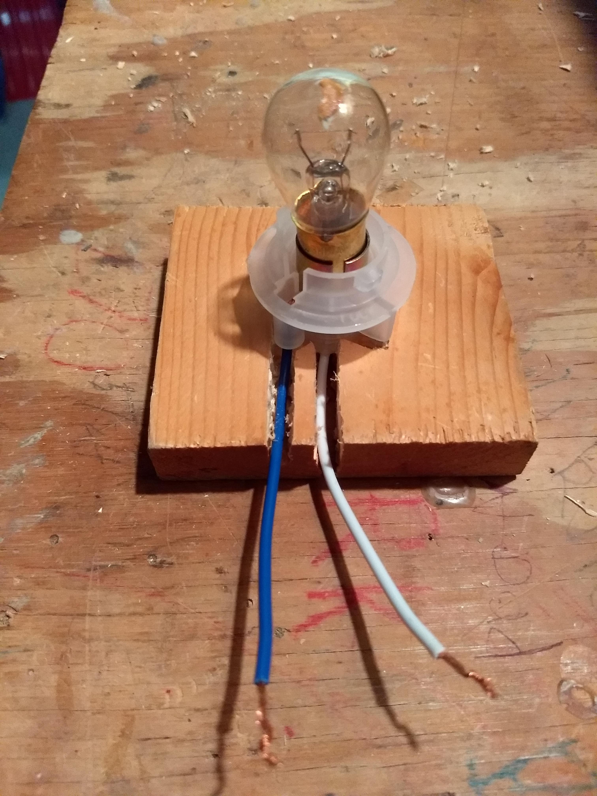
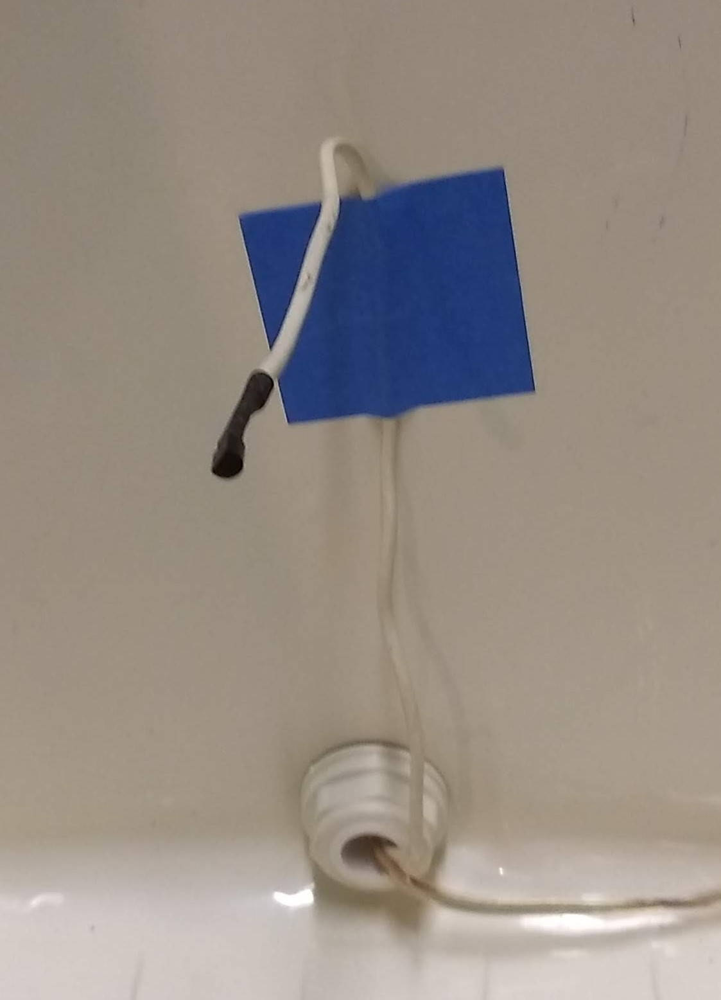
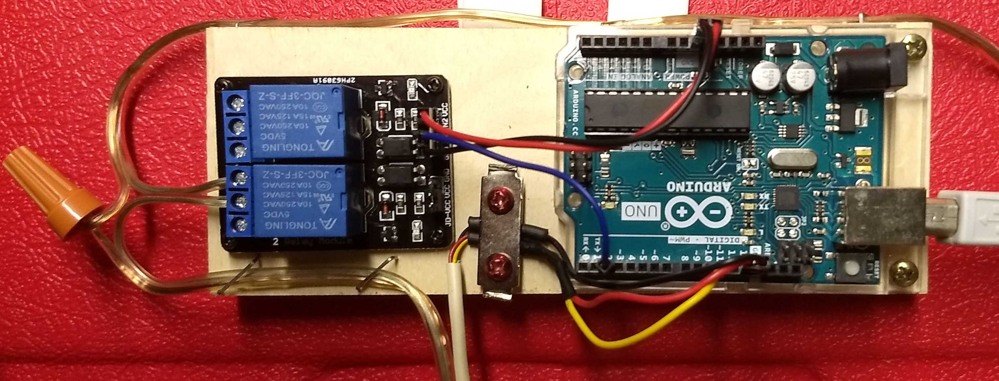
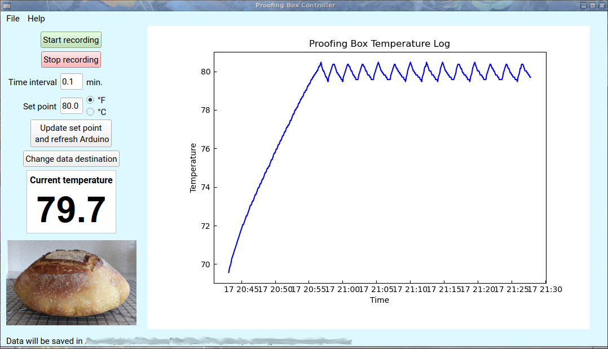

# Prooferator
## Arduino-controlled "proofing" box for bread dough

This project arose from a need for a constant-temperature, warm (but not hot) environment in which to let sourdough bread "proof" - i.e., grow, rise, mature, etc.  It's made from simple stuff I had lying around the house, mostly:
- an Igloo picnic cooler
- a 12V, 15W automotive light bulb
- an old 13.5 VAC "wall-wart" power supply - any ~12 V AC or DC wall-wart will do, as long as it can produce at least 1.25 A of current.
- an Arduino equipped with a DS18S20 temperature sensor and a relay module to run a servo control of the temperature (i.e., a thermostat)

I also created a Python-based GUI (using PyQt5) to monitor the temperature and change the set point.

Perhaps surprisingly, the 15W light bulb is enough to heat the interior of the Igloo to over 90&deg; F.  With a set point of 80&deg; F, the bulb cycles on an off every few minutes.

## Hardware

Here's the Igloo with the lightbulb and sensor installed. No physical modifications are made to the Igloo, so it can be put back to use as a cooler in the future.  The wires come in through the drain hole.  The light bulb is mounted at the far end of the cooler, near the bottom (since heat rises). It's stuck to the inside of the cooler with Velcro Command strips that can be easily removed if necessary. The sensor is at the near end of the cooler and sticks out into mid-air about two-thirds of the way up from the bottom.   

  

The Arduino and relay board are screwed to a wooden block mounted with Velco Command strips to the outside of the Igloo above the drain plug.   

### Light bulb mounting

I purchased a cheap generic automotive light bulb socket on the internet to hold the light bulb.  I then needed something flat to mount to the inside of the cooler. I used a chisel and a drill press to carve up a small block of wood, then epoxied the socket into it.  A little crude, but it works. It is wired with some old speaker wire I had, which should be good for the ~1.5 A of current the bulb will draw.

 

### Sensor mounting

The sensor, together with its pull-up resistor, is soldered to the end of a length of old 4-wire interior telephone wiring and covered in heat-shrink tubing. This wiring is stiff enough to hold the sensor out into the volume of the cooler, so it gets a good reading of the air temperature.

### Wiring
The temperature sensor uses the OneWire Arduino library for communication, so only needs three wires. +5 V is provided to the sensor via the Arduino's pin 13, which is set HIGH in the Arduino code. Ground is provided by the nearby GND pin. The signal wire goes to pin 10, and is also pulled up by a 4.7 k&Omega; resistor attached to +5 V.  The relay board gets its +5V and ground connections from the 5V and GND pins on the Arduino, and relay 1 on the board is connected to pin 2 (relay 2 is not used). The lamp wires are connected to the COM and NO terminals on the relay.

## Software

The software consists of two parts, some Arduino code to set it up as a thermostat, and a Python-based GUI. The Python code was written on a Linux computer.  It should port reasonably well to Windows or macOS, but you will have to change the line where the Pyserial module opens the serial port to communicate with the Arduino.  

#### Requirements:

- Python 3.x
- various Python modules, see the imports in the code
- Arduino IDE

#### Installation and running:

Clone the repository. Connect the Arduino to a USB port and plug in the lamp power supply. To run, <code>cd</code> to the cloned directory and type <code>python prooferator.py</code> at a command prompt. Press the "Update set point and refresh Arduino" button to program the Arduino.  The Arduino should now be controlling the temperature of the Igloo.    

The Arduino code contains the thermostat function. The temperature sensor is read once per second.  If the temperature is lower than the set point minus 0.25&deg; C, the lamp is turned on.  If the temperature is above the set point plus 0.25&deg; C, the lamp is turned off.  The margin of &#177;0.25&deg; C is necessary to keep the light bulb from cycling too much.  It's hard-coded into the Arduino code, but can of course be changed.

The Python GUI provides a plot of the temperature vs time.  Recording can be started or stopped, and the time interval can be chosen.  The setpoint can be chosen in &deg;C or &deg;F.  When the "Update set point and refresh Arduino" button is pressed, the Arduino code is modified and reloaded into the Arduino via <code>os.system()</code> and the <code>arduino --upload</code> command.  This button will need to be pressed at least once when starting with an unprogrammed Arduino. When recording is stopped, or the program is exited, an option to save the data is provided.  The data destination can also be changed if desired.

Once the Arduino is programmed, the proofing box can be run without the monitor software by powering the Arduino though its 5V supply input.

Enjoy your bread!

